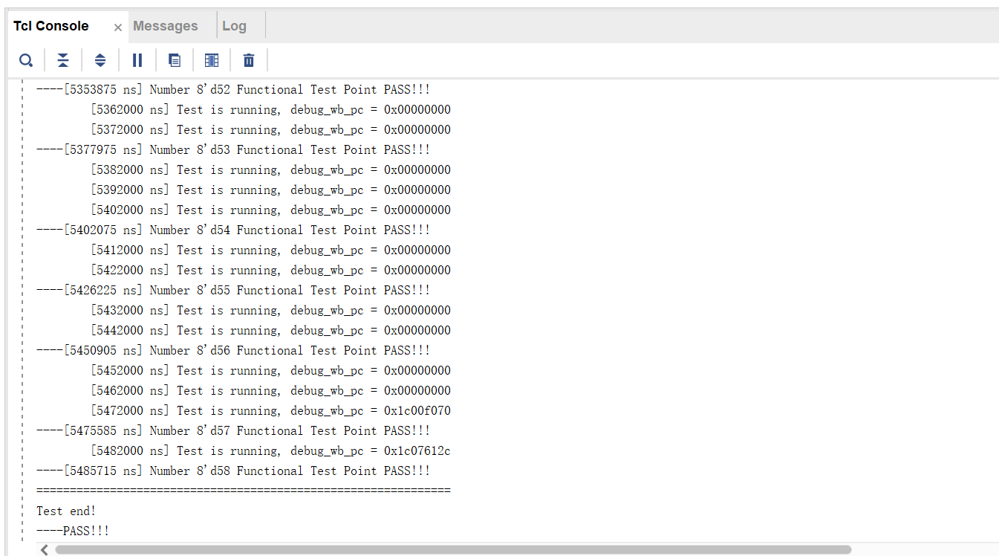

# CPU-design

## 作品说明

龙芯杯《CPU设计实战》汪文祥 全书代码 完整版 Loongarch版 
exp7-exp19全代码

**创作者：**西北工业大学 1队

**联系方式：3545711979@qq.com

exp20-exp23暂未上传（cache部分）

**Cache部分代码（EXP20—EXP23）将不久后更新，欢迎关注！！！**

按照书中方法，将代码添加到相应位置，即可通过仿真测试和上板测试

相关代码获得 **2025年龙芯杯全国大学生系统能力大赛团体赛 三等奖**

## 部分代码仿真验证详情

这里呈现了EXP15—EXP19运行成功详情

备注：验证vivado环境为**vivado2023.2**版本

靠后的实验仿真需要花费一段时间（5分钟左右），耐心等待即可

进行测试前，请更新IP核，否则将会编译失败

### EXP15

如图，成功通过58个测试点

### EXP16

如图，成功通过58个测试点

### EXP17

这部分实验要求单独设计TLB模块，与完整CPU设计无必要关联，因此暂未上传，后续会更新。

### EXP18

如图，成功通过70个测试点

### EXP19

如图，完整通过72个测试点

